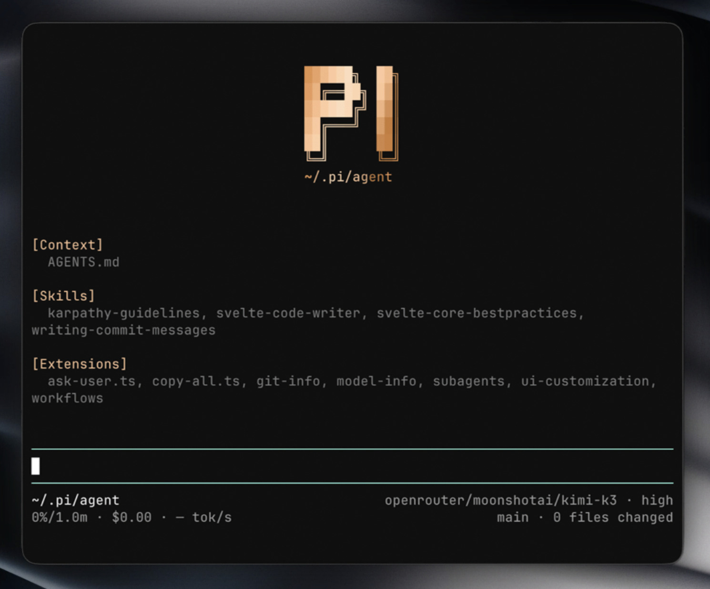

# My pi setup

- sets up vesper as the default theme
- adds subagents
- adds workflows
- lets the model ask multiple-choice questions via the ask-user tool
- updates the bottom bar with useful info

